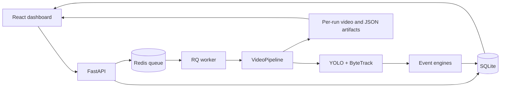

# VisionGuard

VisionGuard is an end-to-end video analytics prototype for person detection,
multi-object tracking, event understanding, and reviewable analysis runs. It combines
YOLO and ByteTrack with FastAPI, Redis/RQ, SQLite, and a React dashboard.

## Problem

Security video becomes useful only when detections can be associated over time, converted
into explainable events, processed outside the request lifecycle, and reviewed with the
correct output artifact. VisionGuard implements that complete path rather than stopping at
a model notebook.

## Portfolio Snapshot

| Area | Implementation |
| --- | --- |
| Vision | YOLO26 person detection, ByteTrack, trajectories, configurable confidence |
| Events | Line crossing, intrusion, loitering, continuity and duplicate diagnostics |
| Service | FastAPI, Redis/RQ worker, SQLite lifecycle and event persistence |
| UI | React/TypeScript run submission, polling, analytics, diagnostics, downloads |
| Reliability | Per-run artifacts, readiness checks, bounded async encoding, failure propagation |
| Evaluation | Custom MOT evaluator locally validated against TrackEval on eight camera prediction files |
| Performance | Stage timing, async writer, FFmpeg H.264 NVENC, controlled throughput comparisons |

## Architecture



Each API run owns `outputs/<run_id>/annotated.mp4`; optional JSONL and metadata files
are placed in the same directory. The client cannot choose a shared output filename.
See [architecture](docs/architecture.md) for module boundaries and runtime flow.

## Verified Evaluation

Camera 1 was used for confidence calibration. Camera 3 was evaluated once with the
confidence selected on camera 1. Both sequences have frame-level CVAT/MOT annotations.

| Sequence | Model | Confidence | HOTA | MOTA | IDF1 | Precision | Recall | IDSW |
| --- | --- | ---: | ---: | ---: | ---: | ---: | ---: | ---: |
| Camera 1 calibration | Pretrained YOLO26n | 0.30 | **40.905** | **38.789** | **49.548** | **94.021** | 41.782 | **78** |
| Camera 1 calibration | MOT17 fine-tuned | 0.40 | 30.526 | 12.212 | 34.666 | 61.638 | 34.573 | 196 |
| Camera 3 locked holdout | Pretrained YOLO26n | 0.30 | **57.349** | **63.790** | **77.504** | **95.304** | 67.240 | **15** |
| Camera 3 locked holdout | MOT17 fine-tuned | 0.40 | 54.872 | 54.114 | 73.444 | 71.886 | **90.051** | 79 |

Local validation shows that the evaluator matches TrackEval commit
`12c8791b303e0a0b50f753af204249e622d0281a` for HOTA, DetA, AssA, LocA, MOTA,
MOTP, IDF1, TP, FP, FN, ID switches, and fragmentations on all eight regenerated
prediction files. Reports store checkpoint/config/input SHA-256 hashes and environment
metadata. The older MOT17 tables in [the experiment log](docs/mot17_baseline.md) are
historical until the removed MOT17 ground truth is restored and those results are rerun.
The sanitized [evaluation evidence manifest](docs/evaluation_evidence.md) records the
camera metrics, prediction hashes, artifact hashes, and validation scope without bundling
private media or model weights.

## Performance

Controlled tests on an NVIDIA GeForce RTX 3050 6 GB Laptop GPU measured:

| Input | Sync OpenCV | Async OpenCV | Async NVENC |
| --- | ---: | ---: | ---: |
| 1080p, 25 FPS | 9.423 FPS | 14.435 FPS | **27.752 FPS** |
| 4K, 30 FPS | 5.042 FPS | 10.097 FPS | **16.853 FPS** |

These are selected controlled runs, not a claim of stable real-time throughput for every
scene. End-to-end speed varies with resolution, scene density, thermal state, and concurrent
GPU load. The API exposes per-stage timing to make that variation inspectable.

## Limitations

- The API accepts trusted local paths; it has no authentication or upload/storage boundary.
- Camera 2, the most complex station scene, does not have tracking ground truth.
- Line and ROI geometry remain camera-specific and use image coordinates.
- `ffmpeg_nvenc` fails safely but does not automatically fall back to CPU/OpenCV encoding.
- Model weights, videos, generated reports, and datasets are intentionally not bundled.
- Redis/RQ transport requires an external Redis service; `/readiness` reports when it or a
  worker is unavailable.
- This is a portfolio prototype with defensible evaluation evidence, not a production-ready
  surveillance product.

See the [one-page case study](docs/case_study.md) and
[90-second demo recording guide](docs/demo_script.md).

## Development History

Week 1 completed:

- OpenCV video pipeline
- YOLO26 object detection
- Confidence filtering
- Class filtering
- Bounding-box visualization
- Processing FPS measurement
- Video output
- CLI interface

Week 2 completed:

- ByteTrack integration
- Persistent object IDs
- Track abstraction
- Centroid and bottom-center extraction
- Track trajectory visualization
- Track history cleanup
- IoU implementation
- Geometry unit tests

Week 3 implemented and evaluated: line crossing and people counting.

Week 4 implemented and manually evaluated: restricted-zone intrusion and loitering.
The current baseline includes three independent event engines, annotated video output,
and a three-video evaluation. See [Week 4 evaluation](docs/week4_evaluation.md)
for results, failure analysis, and remaining validation items.

Week 5 completed: YAML configuration, a reusable `VideoPipeline`, structured logging,
JSONL event persistence, run metadata, and regression checks against the Week 4
video baseline. See [architecture](docs/architecture.md) for module responsibilities
and runtime data flow.

Week 6 completed: SQLite run and event persistence, a FastAPI read/analysis API,
per-run analytics, annotated-video download, and interrupted-run recovery at API
startup. See the [Week 6 summary](docs/week6_summary.md) and [API guide](docs/api.md).

## Pipeline

```text
CLI or FastAPI + YAML Config
  |
  v
AnalysisService + RunRecorder
  |-- SQLite: analysis_runs + events
  |-- Optional: Event JSONL + Run Metadata JSON
  |
  v
VideoPipeline
  |
  v
OpenCV VideoCapture
  |
  v
YOLO
  |
  v
ByteTrack
  |
  v
Track[]
  |-- LineCrossingEngine
  |-- IntrusionEngine
  |-- LoiteringEngine
  |
  v
Event[]
  |
  v
Counters + Console Logging + Visualization
  |
  v
Annotated Output Video
```

## Installation

```bash
conda env create -f environment.yml
conda activate visionguard
```

## Configuration

VisionGuard uses validated YAML configuration. The available Week 4 baseline
configs are camera-specific and use coordinates in the original video frame:

```text
configs/default.yaml
configs/week4_video_a.yaml
configs/week4_video_b.yaml
configs/week4_video_c.yaml
configs/week6.yaml
configs/person_tracking_final.yaml
```

Each config specifies the model, confidence threshold, line, ROI polygon, event
thresholds, output codec, and event artifact paths. CLI values explicitly supplied
by the user override YAML values.

For cameras with temporary occlusion, `tracking.tracker_config` can reference a
custom Ultralytics ByteTrack YAML. `configs/bytetrack_week6.yaml` keeps lost tracks
for 75 frames. Loitering can additionally preserve a visit across a replacement
track ID when `id_reassociation_frames` and `id_reassociation_distance_px` are both
positive. This is a bounded position/time continuity heuristic, not appearance-based
person re-identification; tune it per camera to avoid merging nearby people.

`configs/person_tracking_final.yaml` is the tracking-only configuration selected by the
camera ground-truth benchmark. It uses asynchronous FFmpeg H.264 NVENC output. This mode
requires `ffmpeg` on `PATH` with the `h264_nvenc` encoder; the default output backend remains
portable synchronous OpenCV. The writer queue is bounded by
`output.writer_queue_size` to prevent unbounded frame memory growth.

Week 6 also enables conservative track continuity. A replacement ID must remain
compatible by class, position, motion, and bounding-box size for two consecutive frames;
ambiguous nearby-person matches are rejected. The continuity window is 5 frames, with a
minimum one-frame detection gap before a replacement can be considered. The existing
bounded loitering reassociation remains enabled as a fallback while the new continuity
layer is evaluated.

For this camera, Week 6 keeps a loiter visit eligible for ID reassociation for up to 750
frames (about 30 seconds at 25 FPS) within a 60-pixel position gate. This prevents one
person's long chain of tracker IDs from producing multiple loitering events.

Week 6 also quarantines a younger, contained duplicate box from event processing while it
is confirmed across three consecutive compatible observations. Raw tracker output and
annotated video remain unchanged for auditability. Duplicate state is retained for 5
frames so short detector gaps do not reset confirmation. After a duplicate pair is
confirmed, event-ID handoff remains available for only 5 frames, so a short primary-track
gap does not create a second visit for the same person.

The repository files above remain version-controlled templates. Run CLI commands from the
repository root so relative paths such as `configs/default.yaml`, `data/videos/`, and
`data/outputs/` work on Windows, macOS, and Linux. API storage roots are configurable and
do not need to use a particular drive or home directory.

The Week 6 camera evaluation selected confidence 0.40 with ByteTrack `track_buffer: 75`.
The rejected confidence and tracker experiments were kept out of the runtime config
folder after evaluation.

```text
CLI override > YAML config > model default
```

## Usage

```bash
python -m scripts.run_video --config configs/person_tracking_final.yaml --source path/to/input.mp4 --output data/outputs/annotated.mp4 --no-display
```

Replace `path/to/input.mp4` with the path to a video on your machine. Relative and absolute
paths are both accepted by the CLI.

Evaluate raw ByteTrack and canonical continuity on the seven unique MOT17 training
sequences without converting image sequences to video:

```bash
python -m scripts.evaluate_mot17 --dataset path/to/MOT17 --config configs/week6.yaml --output-dir data/mot17_benchmark/conf_010 --variant FRCNN --conf 0.10 --disable-continuity
```

The dataset and generated prediction files are ignored by Git. See
`docs/mot17_baseline.md` for the current baseline and interpretation.

## HTTP API

Start the local API server from the project root:

```bash
python -m uvicorn src.api.app:app --reload
```

Open `http://127.0.0.1:8000/docs` for Swagger UI. The root endpoint at
`http://127.0.0.1:8000/` lists the main API paths.

| Method | Path | Purpose |
| ------ | ---- | ------- |
| `GET` | `/health` | Verify SQLite availability. |
| `GET` | `/readiness` | Verify database writes, Redis, a live worker, and output storage; report FFmpeg/NVENC capabilities. |
| `GET` | `/runs` | List persisted video-analysis runs. |
| `GET` | `/runs/{run_id}` | Get one run and its lifecycle status. |
| `GET` | `/runs/{run_id}/analytics` | Get counters and event aggregates. |
| `GET` | `/runs/{run_id}/output` | Download a completed annotated video. |
| `GET` | `/events` | List events, optionally filtered by `run_id` or `event_type`. |
| `POST` | `/analyze` | Start an analysis job and return a `run_id`. |

`POST /analyze` persists a `queued` run and sends it to Redis. The separate RQ worker
runs inference, changing the status to `running`, then `completed` or `failed`. Poll
`GET /runs/{run_id}` to follow the lifecycle.

```json
{
  "source_path": "<absolute-source-root>/test.mp4",
  "config_path": "<absolute-config-root>/default.yaml"
}
```

Replace the angle-bracket placeholders with absolute directories on your machine. Set
`VISIONGUARD_SOURCE_ROOT`, `VISIONGUARD_CONFIG_ROOT`, and `VISIONGUARD_OUTPUT_ROOT` to the
same directories before starting the API. The server creates
`<absolute-output-root>/<run_id>/annotated.mp4` and persists that resolved path with the run.

See [API guide](docs/api.md) for request examples, lifecycle behavior, and error codes.

## Dashboard

The React + Vite dashboard is in `web/`. Start the FastAPI server first, then start
the dashboard in a second terminal:

```bash
cd web
npm install
npm run dev
```

Open `http://127.0.0.1:5173`. The Vite development server proxies `/api` requests to
`http://127.0.0.1:8000`, so local browser requests do not require a CORS setting.

The dashboard provides a form to start analysis jobs, a selectable run list, automatic
polling for active runs, run analytics, event records, error visibility, and completed
annotated-video download.

For safety, requested source/config paths must stay inside the configured source and config
roots; server-owned artifacts stay inside the configured output root. See the
[API guide](docs/api.md) for environment-variable examples and dashboard CORS settings.

## Redis Queue Service

Redis is configured in `compose.yaml` for the RQ-based durable analysis worker.
Open Docker Desktop and run:

```bash
docker compose up -d redis
docker compose exec redis redis-cli ping
```

The expected response is `PONG`. Redis listens only on `127.0.0.1:6379` and keeps queue
data in a Docker named volume. See [Redis service guide](docs/redis.md) for lifecycle
commands and queue architecture.

Start the RQ worker in another terminal before submitting dashboard analysis jobs:

```powershell
python -m scripts.run_worker
```

## CLI Overrides

```bash
python -m scripts.run_video --config configs/default.yaml --source path/to/input.mp4 --output data/outputs/annotated_conf_05.mp4 --conf 0.5 --no-display
```

`--conf`, `--model`, and `--no-display` override their config counterparts for the
current run only. Input videos and generated artifacts are ignored by Git.

## Persistence and Output Artifacts

SQLite is the source of truth for every run and emitted event. The default database is:

```text
data/visionguard.db
```

It contains `analysis_runs` for run lifecycle and final metrics, plus `events` for
individual line-crossing, intrusion, and loitering events. The database and generated
videos are ignored by Git.

JSONL and metadata remain optional artifacts. They are written only when both logging
paths are configured:

```text
event_jsonl_path
run_metadata_path
```

When enabled, JSONL shares the same `run_id` as SQLite. API runs place `events.jsonl`,
`metadata.json`, and `annotated.mp4` together under the run directory. `events.jsonl`
contains one record per emitted event; `metadata.json` stores the resolved configuration
and final run summary.

```json
{
  "run_id": "uuid",
  "frame_id": 139,
  "event_type": "intrusion",
  "track_id": 2,
  "video_timestamp": 4.63,
  "position": {"x": 480, "y": 732},
  "direction": null,
  "zone_id": "restricted-zone-1",
  "duration_seconds": null
}
```

`video_timestamp` is time within the source video; `logged_at` in each JSONL record
is the wall-clock time when VisionGuard wrote the event.

## Tracking Confidence Experiment

To evaluate the effect of detection confidence on tracking stability, the same crowded video was tested with different confidence thresholds.

### Observation

With `conf=0.2`, the tracker generated new track IDs much more frequently. When a person was temporarily missed because of occlusion or weak detection, the person often reappeared with a new and significantly larger track ID. The overall track ID count also increased very quickly, indicating a larger number of short-lived or noisy tracks.

With `conf=0.4`, track IDs still increased over time, which is expected when new objects enter the scene, but the increase was noticeably slower. More importantly, some people who were temporarily missed were successfully associated with their previous track ID when they reappeared. This behavior was less stable with `conf=0.2`.

### Comparison

| Confidence | Tracking behavior |
| ---------- | ----------------- |
| `0.2` | More weak detections, rapid growth in track IDs, more short-lived tracks, and more frequent ID reassignment after temporary misses |
| `0.4` | Fewer noisy tracks, slower ID growth, and better ID continuity for several objects after short occlusions |

### Conclusion

For the tested crowded scene, lowering the confidence threshold did not improve tracking quality. Although a lower threshold provides more detections to ByteTrack, it also introduces additional low-confidence and noisy detections that can interfere with track association and create unnecessary new tracks.

In this experiment, `conf=0.4` provided a better balance between detection coverage and tracking stability. It produced fewer fragmented tracks and showed better identity continuity after temporary missed detections.

Therefore, `0.4` is currently used as the default detection confidence threshold for VisionGuard. This value is treated as a scene-dependent hyperparameter rather than a universal optimal threshold and may be adjusted for different camera conditions or datasets.

## Week 3 - Line Crossing & People Counting

Implemented:

- Virtual line crossing detection
- IN / OUT direction classification
- Finite line-segment intersection
- Pixel-based dead zone
- Bottom-center based crossing geometry
- Stateful crossing detection
- Multi-frame side confirmation
- Track state cleanup
- IN / OUT / NET counters
- Unit tests for geometry and event state

## Line Crossing Evaluation

The line-crossing system was evaluated on three videos with increasing levels of difficulty:

| Video | Scenario | Ground Truth IN | Ground Truth OUT |
| ----- | -------- | --------------: | ---------------: |
| A | Simple scene, few people, low occlusion | 2 | 4 |
| B | Medium scene, more people, turn-backs and near-line movement | 8 | 5 |
| C | Crowded scene with occlusion and unstable tracking | 2 | 12 |

### Dead-Zone Experiment

A pixel-based dead zone was evaluated to reduce false crossing events caused by bounding-box jitter around the virtual line.

#### Video A

| Dead Zone | Predicted IN | Predicted OUT | False Events | Missed Events |
| --------: | -----------: | ------------: | -----------: | ------------: |
| 3 px | 2 | 3 | 0 | 1 |
| 5 px | 2 | 3 | 0 | 1 |
| 8 px | 2 | 3 | 0 | 1 |
| 10 px | 2 | 3 | 0 | 1 |

The missed event was caused by two people moving very close together, resulting in the detector producing one bounding box instead of two separate detections.

#### Video B

| Dead Zone | Predicted IN | Predicted OUT | False Events | Missed Events |
| --------: | -----------: | ------------: | -----------: | ------------: |
| 3 px | 7 | 4 | 0 | 2 |
| 5 px | 7 | 4 | 0 | 2 |
| 8 px | 6 | 4 | 0 | 3 |
| 10 px | 5 | 4 | 0 | 4 |

One missed event was caused by overlapping bounding boxes. Other missed events were observed when tracking became unstable or temporarily disappeared near the virtual line.

Increasing the dead zone beyond 5 pixels also increased the number of missed crossings.

#### Video C

| Dead Zone | Predicted IN | Predicted OUT | False Events | Missed Events |
| --------: | -----------: | ------------: | -----------: | ------------: |
| 3 px | 5 | 13 | 8 | 4 |
| 5 px | 3 | 12 | 5 | 4 |
| 8 px | 2 | 11 | 3 | 4 |
| 10 px | 2 | 11 | 3 | 4 |

The crowded scene produced significantly more false crossing events. These were mainly caused by bounding-box positions oscillating around the virtual line.

Increasing the dead zone reduced false events from 8 at 3 pixels to 3 at 8 pixels.

The remaining missed events were mainly caused by overlapping bounding boxes and tracking instability under heavy occlusion.

### Failure Analysis

| Failure | Observed Cause | Pipeline Layer |
| ------- | -------------- | -------------- |
| Two people counted as one | Nearby people merged into one bounding box | Detection |
| Missed crossing | Overlapping bounding boxes | Detection |
| Missed crossing near the line | Track temporarily lost or fragmented | Tracking |
| Duplicate / false crossing | Bounding-box jitter around the virtual line | Tracking / Event |
| New identity after occlusion | ByteTrack assigns a new track ID | Tracking |

### Conclusion

The experiments show that the line-crossing dead zone provides a trade-off between false-event suppression and crossing recall.

A small dead zone such as `3 px` is more sensitive to bounding-box jitter, especially in crowded scenes. Increasing the dead zone reduces false crossings, but overly large values such as `8-10 px` can cause valid crossings to be missed.

Based on the three evaluated videos, VisionGuard currently uses:

```text
Detection confidence: 0.4
Line-crossing dead zone: 5 px
```

A `5 px` dead zone was selected as the current default because it provides a practical balance between event stability and crossing recall across the tested scenes.

The experiments also show that many remaining counting errors originate upstream from detection and tracking rather than from the line-crossing state machine itself.

### Current Limitations

- Counting accuracy depends on stable object detection and tracking.
- Closely overlapping people may be merged into a single bounding box.
- Long or heavy occlusion can cause track loss or ID reassignment.
- Bounding-box jitter near the virtual line can still produce false events in crowded scenes.
- The virtual line and dead-zone threshold currently require manual configuration for each camera.
- The current geometry operates in image coordinates and does not compensate for perspective distortion.

### Side Confirmation Experiment

To further reduce false crossing events caused by bounding-box oscillation around the virtual line, a side-confirmation mechanism was evaluated on the crowded test video.

A crossing transition is accepted only when a track remains on the new side of the virtual line for a specified number of consecutive frames.

| Confirmation Frames | Predicted IN | Predicted OUT | False Events | Missed Events |
| ------------------: | -----------: | ------------: | -----------: | ------------: |
| 1 | 3 | 11 | 4 | 4 |
| 2 | 3 | 11 | 4 | 4 |
| 3 | 2 | 10 | 2 | 4 |
| 5 | 2 | 10 | 2 | 4 |

Increasing the confirmation requirement from 1 to 3 frames reduced false crossing events from 4 to 2 without increasing the number of missed crossings.

Using 5 confirmation frames did not provide any additional improvement compared with 3 frames and would introduce additional event latency.

Therefore, VisionGuard currently uses:

- Detection confidence: `0.4`
- Line dead zone: `5 px`
- Side confirmation: `3 frames`

The confirmation mechanism is particularly useful in crowded scenes where bounding-box positions can oscillate around the virtual line for several consecutive frames.

### Remaining Failure Cases

After applying a 5-pixel dead zone and 3-frame side confirmation, false crossing events were reduced significantly.

The remaining errors were mainly associated with upstream computer-vision failures:

- Overlapping people producing unstable or merged bounding boxes
- Temporary loss of tracks near the virtual line
- ID fragmentation after occlusion
- Prolonged bounding-box instability in crowded areas

These errors cannot be fully corrected by the line-crossing state machine alone because the event engine depends on the quality and identity consistency of upstream tracks.

### Final Week 3 Configuration

- Detection confidence: `0.4`
- Dead zone: `5 px`
- Side confirmation: `3 frames`
- Maximum missing frames: `30`

These values were selected empirically on three videos with different levels of crowding and occlusion.

## Week 4 - Restricted-Zone Intrusion & Loitering

Implemented:

- Polygon ROI and self-implemented ray-casting point-in-polygon geometry
- Bottom-center based ROI membership checks
- Intrusion events after a configurable consecutive-inside ROI confirmation
- Loitering events based on video timestamps and a configurable dwell threshold
- Independent per-track state and stale-state cleanup
- Combined line crossing, intrusion, and loitering processing on every frame
- ROI outlines, track trajectories, event counters, and console event logs
- Unit tests for polygon geometry, intrusion, loitering, and multi-engine integration

### Design Decisions

- Points on polygon edges or vertices are treated as inside the ROI.
- A track's first observation does not produce an intrusion event, even if inside.
- `entry_confirmation_frames` requires consecutive observed inside frames after an
  outside state before an intrusion is emitted; the supplied runtime configs use `6`.
- `exit_confirmation_frames` requires consecutive observed outside frames before a
  confirmed track is re-armed for a later intrusion; runtime configs also use `6`.
- Loitering starts at the first observed inside position and triggers once per visit.
- An observed exit resets the loitering visit; a later re-entry can produce new events.
- Short tracking gaps retain state within the configured frame-gap limit. Loitering
  duration includes that gap, but an event is emitted only on an observed inside track.
- Dwell time measures presence in the ROI; the person does not need to stand still.
- Event engines perform no drawing; visualization is handled separately.

### Evaluation Summary

Three videos were manually evaluated with a **5-second loitering threshold**.
Intrusion results below are calculated from the author's reported event matches:

| Video | Ground Truth | Predicted | TP | FP | FN | Precision | Recall | F1 |
| ----- | -----------: | --------: | -: | -: | -: | --------: | -----: | -: |
| A | 6 | 5 | 5 | 0 | 1 | 100.00% | 83.33% | 90.91% |
| B | 10 | 12 | 10 | 2 | 0 | 83.33% | 100.00% | 90.91% |
| C | 2 | 2 | 2 | 0 | 0 | 100.00% | 100.00% | 100.00% |
| **Total (micro)** | **18** | **19** | **17** | **2** | **1** | **89.47%** | **94.44%** | **91.89%** |

Loitering detected **1/1 reported ground-truth event**, with no reported false
loitering events across the three clips. This is a small baseline with only one
positive loitering example, not evidence of general-purpose accuracy.

Observed failures:

- **Video A:** one missed intrusion when two nearby people shared a single bounding box.
- **Video B:** two false intrusions caused by bottom-center jitter across the ROI boundary.
- **Video C:** no reported event errors; part of the configured ROI extends beyond the image.

Full ROI coordinates, clip metadata, methodology, and follow-ups are documented in
[docs/week4_evaluation.md](docs/week4_evaluation.md).

### ROI Stabilization Rerun

The 2026-09-18 rerun used six consecutive observed frames for both ROI entry and
exit confirmation. Counts were A: `5` intrusion / `0` loitering, B: `10` / `1`,
and C: `2` / `0`. B dropped from 12 to 10 intrusion alerts while A and C retained
their baseline counts. Event-level visual matching is still required before
replacing the baseline precision/recall metrics.

### Running the Week 4 Baseline

Use the corresponding YAML configuration. ROI coordinates are in original-frame
pixels and are camera-specific.

```bash
python -m scripts.run_video --config configs/week4_video_a.yaml --source data/videos/videoA.mp4 --output data/outputs/week5_videoA.mp4 --no-display
python -m pytest tests/ -q
```

Replace the source path with your local video. The local demo outputs are
`data/outputs/week4videoA.mp4`, `data/outputs/week4videoB.mp4`, and
`data/outputs/week4videoC.mp4`. Input/output videos are ignored by Git and are not
bundled with a clone of this repository.

### Week 5 Regression Check

The Week 4 baseline was rerun through the config-driven pipeline. The intrusion and
loitering counts matched all three pre-refactor runs.

| Video | Week 4 Intrusion | Week 5 Intrusion | Week 4 Loitering | Week 5 Loitering | Status |
| ----- | ----------------: | ----------------: | ----------------: | ----------------: | ------ |
| A | 5 | 5 | 0 | 0 | Matched |
| B | 12 | 12 | 1 | 1 | Matched |
| C | 2 | 2 | 0 | 0 | Matched |

### Remaining Improvements

- Add timestamped physical-person annotations before reporting revised metrics.
- Add more positive loitering examples with occlusion and re-entry.
- Add stable inside/outside confirmation to reduce boundary-jitter duplicates,
  then re-evaluate all three clips for any loss in recall.
- Add event timestamps and track references to the annotations, measure loitering
  trigger delay, and expand the number of positive loitering examples.
- ID switches can reset dwell timers or cause repeated alerts for the same physical
  person; short-gap continuity assumes no unobserved exit and re-entry.
