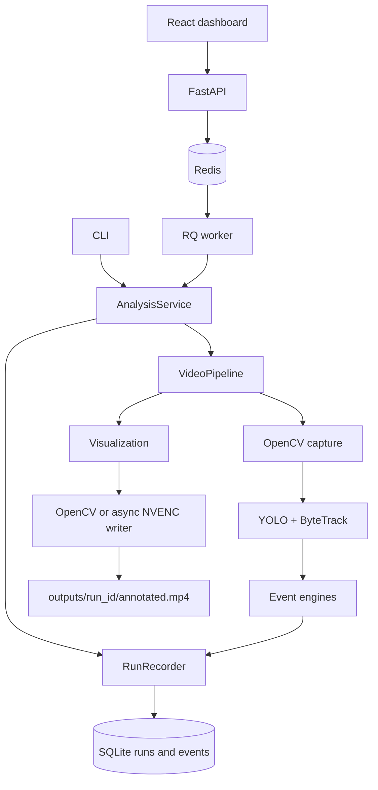

# VisionGuard Architecture

## Overview

VisionGuard processes a local video into an annotated output video, persisted events,
and run metadata. SQLite is the persistence source of truth; JSONL is optional.



## Module Responsibilities

| Module | Responsibility |
| ------ | -------------- |
| `src/config.py` | Loads YAML and validates application configuration with Pydantic. |
| `src/pipeline/video_pipeline.py` | Owns the video loop, runtime state, resources, event dispatch, and output result. |
| `src/tracking/` | Converts YOLO/ByteTrack output into `Track` objects and stores trajectories. |
| `src/events/` | Implements line-crossing, intrusion, loitering, geometry, and per-track state. |
| `src/visualization.py` | Draws overlays only; it does not contain event logic. |
| `src/event_jsonl.py` | Streams individual events to JSONL and writes run metadata. |
| `src/database/sqlite_repository.py` | Creates SQLite schema and persists/queries runs, events, analytics, and interrupted runs. |
| `src/run_recorder.py` | Records a shared `run_id` to SQLite and optional JSONL artifacts. |
| `src/analysis_service.py` | Creates and executes reusable analysis jobs for both CLI and FastAPI. |
| `src/api/` | Exposes liveness/readiness, runs, events, analysis, analytics, and output-download endpoints. |
| `src/video.py` | Owns OpenCV/FFmpeg writers, bounded async encoding, stderr draining, and shutdown handling. |
| `scripts/run_worker.py` | Runs the durable Redis/RQ analysis worker. |
| `src/logging_config.py` | Configures readable application logging. |
| `scripts/run_video.py` | Parses CLI arguments, resolves overrides, executes an analysis job, and prints a summary. |

## Runtime Flow

```text
Frame
  -> YOLOByteTracker.track()
  -> Track[]
  -> TrackHistory.update()
  -> LineCrossingEngine.process()
  -> IntrusionEngine.process()
  -> LoiteringEngine.process()
  -> Event[]
  -> Event handler -> RunRecorder -> SQLite + optional events.jsonl
  -> Visualization -> annotated output frame
```

Event engines receive `Track[]`, `frame_id`, and video timestamp. They do not
depend on OpenCV, command-line parsing, YAML files, or persistence.

## Configuration

YAML configuration is validated before the pipeline starts. Configuration covers
the model, detector confidence, tracking state retention, line geometry, ROI zones,
event thresholds, output settings, logging paths, and optional FPS override.

```text
CLI override > YAML config > model default
```

Week 4 baseline configurations are stored in:

```text
configs/week4_video_a.yaml
configs/week4_video_b.yaml
configs/week4_video_c.yaml
```

Line and ROI coordinates use the original video coordinate system. A configuration
must be changed or transformed when the camera view or input resolution changes.

## Pipeline API

`VideoPipeline` is independent of `argparse` and can be called directly by a future
FastAPI endpoint:

```python
from pathlib import Path

config = load_config("configs/default.yaml")
pipeline = VideoPipeline(config)

result = pipeline.run(
    source_path=Path("input.mp4"),
    output_path=Path("output.mp4"),
)
```

`PipelineResult` includes source and effective FPS, core-processing and end-to-end
throughput, processed frame count, event counters, output path, elapsed time, and
whether the user stopped the preview early.

Each `run()` resets tracker state and creates a new trajectory history and event-engine
set. A reused pipeline may retain the loaded model, but identities and event state do not
leak from one analyzed video into the next.

## Timing

| Field | Meaning |
| ----- | ------- |
| `source_fps` | FPS declared by the input video. |
| `effective_fps` | Source FPS or validated `video.fps_override`; used for video timestamps. |
| `core_processing_fps` | Rolling throughput for tracking and event processing. |
| `end_to_end_fps` | Frame-loop throughput including read, events, visualization, and output writing. |

Completed runs also persist `read_seconds`, `tracking_seconds`, `analytics_seconds`,
`drawing_seconds`, `write_enqueue_seconds`, `encoding_seconds`, `writer_flush_seconds`,
`frame_loop_seconds`, and `tracking_fps`. They are returned by the analytics endpoint and
rendered in the dashboard.

Event timestamps are based on source-video time, not wall-clock inference time.
If a source does not provide a valid FPS, the pipeline requires an explicit positive
FPS override instead of silently assuming a value.

## Persistence

Each run is persisted in SQLite, by default at `data/visionguard.db`:

```text
analysis_runs
events
```

`analysis_runs` stores run lifecycle (`running`, `completed`, or `failed`), paths,
resolved config JSON, performance metrics, counters, and failure messages. `events`
stores individual emitted events and references `analysis_runs.run_id`.

JSONL and run metadata are optional and must be configured together. They use the same
`run_id` as SQLite. JSONL retains events already written if a later frame fails;
SQLite records the final failed lifecycle state and error message.

## API Boundary

FastAPI uses `AnalysisService`, not `scripts/run_video.py`. `POST /analyze` creates a
persisted `queued` run and enqueues a serializable job in Redis. The separate RQ worker
transitions the run to `running`, executes `VideoPipeline`, and persists completion or
failure. Clients poll `GET /runs/{run_id}` and can query events, analytics, or download
the annotated video after completion. See the [API guide](api.md) and
[Redis service guide](redis.md) for operational commands.

On Windows, the in-process RQ worker runs a separate heartbeat thread while a job is active,
so long analyses retain a current worker registration without requiring Unix process APIs.

The API owns artifact naming. Each accepted run is assigned
`output_root/<run_id>/annotated.mp4`; optional `events.jsonl` and `metadata.json` are scoped
to the same directory. `/health` is a liveness check, while `/readiness` verifies database
writes, Redis, a current RQ worker heartbeat, and output storage. It also reports FFmpeg
availability and the result of a cached H.264 NVENC encode probe; those informational checks
do not block OpenCV-backed jobs.
